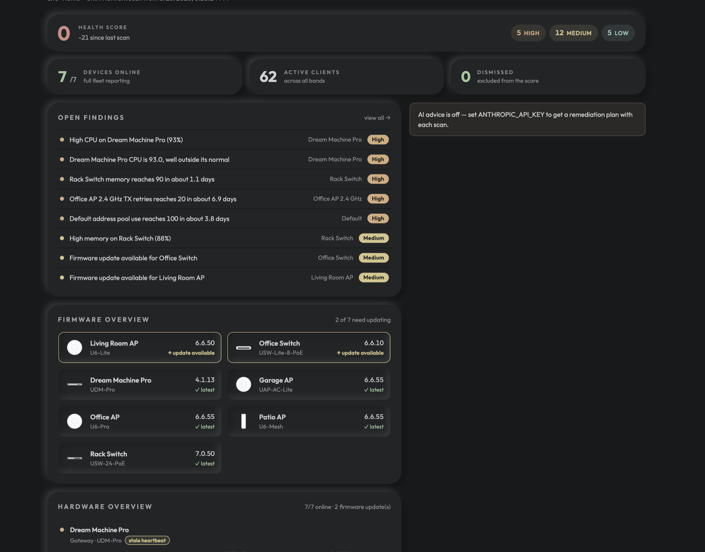
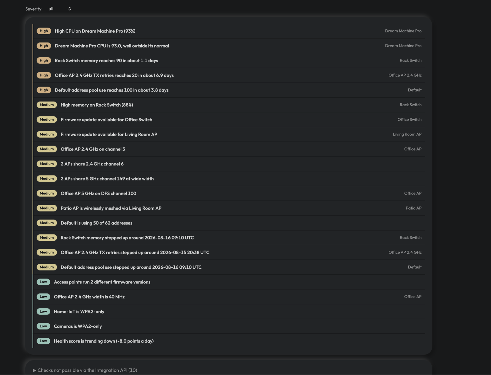
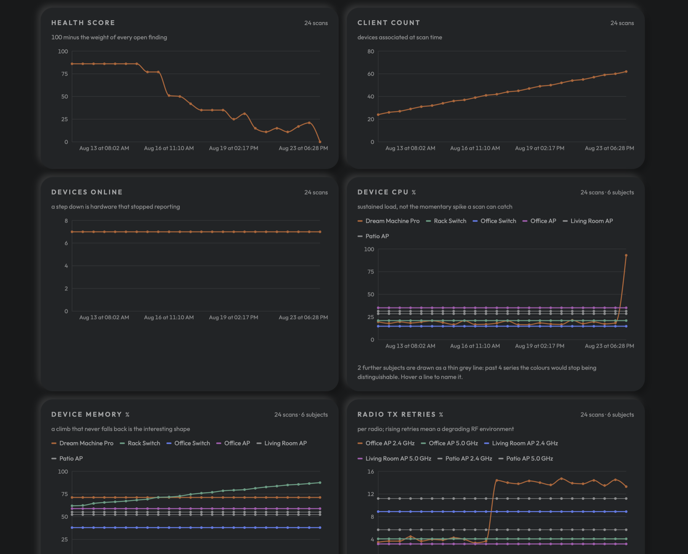
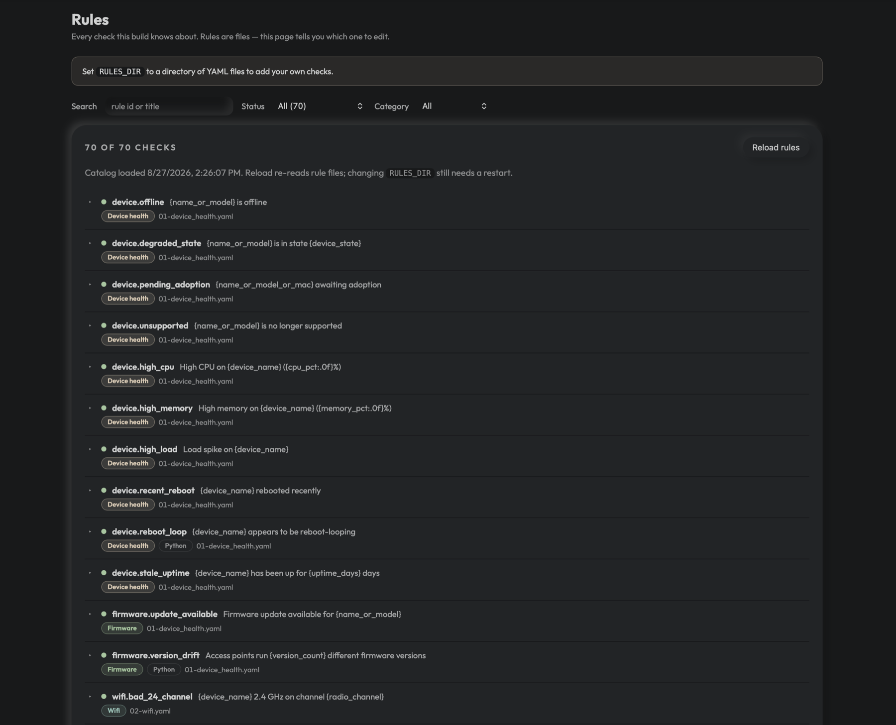

<picture>
  <source media="(prefers-color-scheme: dark)" srcset="docs/wordmark-dark.svg">
  
</picture>

[](https://github.com/anubhabbehera/healing-hertz/actions/workflows/ci.yml)
[](https://codecov.io/gh/anubhabbehera/healing-hertz)
[](LICENSE)

**A health check for your [UniFi](https://ui.com/) network.** Point it at your UniFi
console, press one button, and get a plain-language report of what's wrong and what to
do about it.

It never changes anything on your network. It only reads.

---

## Who this is for

**You run UniFi.** A gateway or console — Dream Machine, UDM Pro/SE, UDR, Cloud Key,
UCG — or a UniFi Network Server you host yourself, with Ubiquiti access points and
switches behind it. You'll need **UniFi Network 9.0 or newer**, which is what exposes
the API this reads from.

You don't need a large network. A gateway and one access point is enough to be worth
scanning; the checks that need more hardware simply don't fire.

**You care about your DNS.** Optional, and there's more here if you do:

| Your setup | What you get |
|---|---|
| **[NextDNS](https://nextdns.io/)** as your resolver | A DNS layer on top of the network checks — malware and phishing domains your devices tried to reach, and unusual spikes in blocked traffic. Set `NEXTDNS_API_KEY` and `NEXTDNS_PROFILE_ID`; see [Optional extras](#optional-extras). |
| **Self-hosted DNS** — Pi-hole, AdGuard Home, Technitium, Blocky | **Not supported yet — planned.** Nothing reads from these today. If you run one, the network and WiFi checks all still work; you just won't get the DNS layer. |
| Neither | Everything else works unchanged. Internet latency and packet loss are still measured directly during each scan. |

## What it does

Most UniFi dashboards tell you *what* your network is doing. healing-hertz tells you
what's **wrong with it** — the access point on a bad channel, the cable that's quietly
running at a tenth of its speed, the device that keeps rebooting — and gives you the
steps to fix each one.

Every scan looks for problems across your whole site and rates each one from
**critical** down to **info**:

**Devices** — anything offline or in a degraded state, access points stuck waiting to
be adopted, high CPU or memory, devices that have rebooted recently, and devices that
keep rebooting over multiple scans (a pattern you'd rarely spot by eye). Also flags
pending firmware updates, access points running mismatched firmware versions, and
devices that haven't restarted in six months.

**WiFi** — 2.4 GHz radios on channels other than 1, 6 or 11; two access points fighting
over the same channel; channel widths that cause more interference than they cure;
radios parked on DFS channels, where a radar hit silences them for half an hour;
access points reaching the network over the air instead of over Ethernet; legacy
802.11b/g rate sets; and radios with high transmission retry rates, including ones
that are getting *worse* compared to your recent scans.

**Wiring** — the classic one: a port negotiating 100 Mbps on a gigabit-capable link,
which almost always means a damaged cable. Also PoE ports that can't deliver full
power, and a gateway running close to its uplink capacity.

**Clients** — guest devices stuck unauthorized, and (with an optional extra, see below)
clients with weak signal, clients bouncing constantly between access points, clients
negotiating legacy data rates that eat everyone else's airtime, strong-signal clients
stuck on 2.4 GHz when band steering should have moved them, and access points carrying
more clients than a radio handles well.

Settings the read-only Integration API doesn't expose — transmit power, band steering,
DTIM, minimum RSSI, automatic channel selection, firewall and VLAN isolation — are
listed as **not checkable**, together with what the community consensus recommends, so
you can audit them yourself instead of assuming they were checked.

**Internet & DNS** — connection latency and packet loss measured during each scan, plus
optional NextDNS analysis that surfaces malware and phishing domains your devices tried
to reach.

Each finding comes with the **evidence** behind it — the actual channel, the actual
CPU percentage — so you can judge it yourself rather than taking the tool's word.

### What it looks like



The **dashboard** opens on the health score and what moved it since last time, then the
open findings and the firmware state of every device.



**Findings** are the detail: every problem, graded, naming the device it concerns.
Expand one for the evidence behind it. Checks the Integration API can't answer are
collected at the bottom rather than quietly omitted.



**Trends** are what you can't get from UniFi itself — each metric judged against its own
history, so you see a radio getting worse before it becomes a problem.



**Rules** lists every check this build knows about and which file it came from. Write
your own, edit them in the browser, or switch off any built-in one.

> The screenshots are from `make demo`, so this is the sample network — the same one
> you get before connecting any hardware.

---

## Getting started

### Before you start

| You need | Why |
|---|---|
| [uv](https://docs.astral.sh/uv/) | Runs the Python backend. `brew install uv` on macOS. |
| [Node.js](https://nodejs.org/) 20 or newer | Builds and serves the interface. `brew install node`. |
| UniFi Network **9.0 or newer** | Only needed to scan your own network — the demo below runs without any hardware. |

### Try it with sample data — no hardware needed

```bash
git clone https://github.com/anubhabbehera/healing-hertz.git
cd healing-hertz
make setup    # one-time: installs everything
make demo     # opens with realistic sample data
```

Then open **http://localhost:5173** and press **Run scan**. You'll see the full
interface working against a made-up network with a handful of deliberate problems.

Press **Ctrl-C** in the terminal to stop it.

### Connecting to your own network

#### 1. Find your console's address

`UNIFI_HOST` is simply **the address you type into your browser to open UniFi**.

| What you have | What to use |
|---|---|
| A UniFi gateway or console — Dream Machine, UDM Pro/SE, UDR, Cloud Key, UCG | Your router's address, usually `192.168.1.1`. If `https://192.168.1.1` shows the UniFi login page, that's it. |
| UniFi Network Server you installed yourself (Docker, Linux, Windows) | That computer's address, plus `UNIFI_PORT=8443` and `UNIFI_API_PREFIX=/integration` |

Don't use `unifi.ui.com` — that's Ubiquiti's cloud portal, not the console on your own
network, and this app talks directly to your console.

#### 2. Create a read-only local admin

Do this first. One account covers both credentials this app can use — the API key you
create in step 3 inherits the permissions of whoever creates it, so making it from a
view-only account is what makes "this tool only reads" a guarantee rather than a
promise.

In your **Network application**, go to **Admins** in the left navigation, press the
**+**, and create the account:

| Setting | Choose | Why |
|---|---|---|
| Role | **View Only** (named *Viewer* on some builds) | Read-only is the whole point. The API key made from this account cannot change your network even if something tried. |
| Remote Management | **Off** | Leaving it off creates a *local* admin with its own username and password. An account invited through Site Manager is a Ubiquiti SSO account instead, and the optional extras in step 4 cannot log in with one. |
| Username / password | Something you'll keep | These are `UNIFI_USERNAME` and `UNIFI_PASSWORD`, which unlock the optional per-client signal and roaming checks — see [Optional extras](#optional-extras). Skip them if you don't want those; the API key alone runs every other check. |

UniFi's menu wording moves between releases. If there's no **Admins** entry in the left
navigation, look under **Settings → Admins & Users**.

#### 3. Create an API key

Log in as the account you just made, then go to **Settings → Control Plane →
Integrations → Create API Key**. (On some versions it's under **Settings → API**, or in
your admin profile.) That key is for the
[UniFi Network Integration API](https://developer.ui.com/unifi-api/) — Ubiquiti's
supported, read-and-write-scoped interface, of which this app only ever reads.

Copy the key when it's shown — you won't see it again.

#### 4. Fill in your settings

```bash
cp .env.example .env
```

Open `.env` and set `UNIFI_HOST` and `UNIFI_API_KEY`. If you want the per-client signal
and roaming checks, add `UNIFI_USERNAME` and `UNIFI_PASSWORD` for the account from
step 2 as well. Then:

```bash
make dev
```

Open **http://localhost:5173**, go to **Settings → Test connection** to confirm it can
reach your console, then press **Run scan**.

### Everyday commands

| Command | What it does |
|---|---|
| `make dev` | Run against your real network |
| `make demo` | Run with sample data (uses a separate database — your real history is untouched) |
| `make stop` | Stop it if you left it running in another window |

Prefer containers? Fill in `.env`, then `make docker-up` (and `make docker-down` to
stop). Run `make` on its own to see everything available.

### Where your data lives

Everything stays on the machine you run it on. There is no account, no cloud sync and
nothing phones home.

| What | Where | Notes |
|---|---|---|
| Scan history | `./healing_hertz.db` (`DB_PATH`) | One SQLite file. Every scan, finding and dismissal lives here — this is what the trends are built from. |
| Demo history | A separate database | `make demo` never touches your real history. |
| Your credentials | `.env` | Never displayed in the app, written to its logs, or included in error messages. |
| Device icons | `./icon-cache/` (`ICON_CACHE_DIR`) | A cache, safe to delete; set `DEVICE_ICONS=false` to never fetch them. |
| Your own rules | `RULES_DIR`, if you set one | Plain YAML you can edit by hand. |

**To start over**, stop the app and delete the database file — the next scan begins a
fresh history. Back it up first if you want to keep your trend line; it's a single file,
so copying it is the whole backup.

---

## Health score, trends and history

Every scan produces a score out of 100. Findings cost points by severity, so the number
moves when your network actually improves or degrades.

Because every scan is saved, you get a **trend** of your network over time — health
score, device CPU, WiFi retries, internet latency — and you can **compare any two
scans** to see exactly what's new, what you fixed, and what's still outstanding.

This matters more than it sounds: UniFi itself doesn't keep this history, so the more
you scan, the more this becomes something you can't get anywhere else.

## AI-written fix plans (optional)

If you add an API key for Claude (or any compatible service), each scan also produces a
prioritized action plan written for *your* network — grouping related problems, spotting
common root causes, and giving concrete steps naming the actual UniFi settings pages.

This is entirely optional. Without a key you still get every finding and every built-in
recommendation; you just don't get the written plan on top.

**Your network details stay private.** Before anything is sent, MAC addresses, IP
addresses and serial numbers are stripped out, personal device names are replaced with
labels like `client-1`, and WiFi network names are removed. Only equipment names (your
access points and switches) are included, because the advice has to be able to name them.

## Dismissing findings you can't fix

Sometimes a finding is correct but not something you're going to act on — an access
point you unplugged on purpose, a cable run you're not going to redo. Open the finding
and choose **Dismiss finding**, optionally with a note explaining why.

Dismissing is a lasting decision, not a temporary hide:

- The finding **stays visible**, marked as dismissed, so you don't lose the information.
- It **stops costing you points**, so your health score reflects the problems you
  actually intend to fix. Dismissing a critical finding gives you 25 points back.
- It applies to **future scans**, so the same known issue doesn't drag the score down
  every time.
- Past scans are re-scored too, so your trend line stays honest instead of showing a
  jump on the day you changed your mind.

You can review or undo dismissals any time under **Settings → Dismissed findings**.

## Adding your own checks

Every check is a YAML entry in a rule catalog, not code — so you can add your own
without forking. Point `RULES_DIR` at a directory of rule files and they load
alongside the built-in ones:

```yaml
- id: custom.spare_port
  kind: declarative
  category: wired
  emits:
    - source: device_ports
      where: [port_state, eq, DOWN]
      severity: info
      title: "{device_name} port {port_idx} is down"
      summary: "Port {port_idx} on {device_name} has no link."
      recommendation: "Nothing to do if the port is deliberately unused."
```

The **Rules** tab lists every check the app knows about and lets you write, edit
and delete your own from the browser — it validates a rule before saving, so a
broken one never lands on disk. You can also switch off any built-in check
without editing the shipped files.

Everything it writes is plain YAML you can edit by hand. See
**[docs/rules.md](docs/rules.md)** for the full syntax — sources, predicates,
severity grading and aggregation.

## Optional extras

These fill gaps that UniFi's official API can't cover on its own. Each is off unless
you enable it, and if one fails your scan still completes without it. Until enabled,
the affected checks appear in the app marked "not checkable", with instructions —
nothing is silently missing.

| What you gain | How to turn it on |
|---|---|
| **Weak-signal clients** and **devices roaming between access points** | Add `UNIFI_USERNAME` / `UNIFI_PASSWORD` — the read-only local admin from [step 2](#2-create-a-read-only-local-admin). It has to be a *local* admin; a Ubiquiti SSO account can't log in this way. Uses an older UniFi interface that Ubiquiti doesn't officially document, so it may change with firmware updates — failures are skipped, never fatal. |
| **Internet latency and packet loss** | On by default. Measured from the computer running the app during each scan, and tracked over time. |
| **DNS problems, malware and phishing blocks** | Add `NEXTDNS_API_KEY` (from your [NextDNS](https://nextdns.io/) account settings) and `NEXTDNS_PROFILE_ID` (the short ID in your profile URL, e.g. `abc123`). Surfaces security blocks and unusual spikes in blocked traffic. See below for pointing your network at NextDNS in the first place. |
| **Product icons for your hardware** | On by default (`DEVICE_ICONS`). The backend looks each model up in Ubiquiti's public device catalogue, fetches the icon once and caches it under `ICON_CACHE_DIR`, then serves it locally — your browser never talks to ui.com, and a machine with no internet access falls back to drawn glyphs. Set `DEVICE_ICONS=false` to make no outbound request at all. |

### Pointing UniFi at NextDNS over encrypted DNS

The NextDNS check reads your profile's analytics, so it only says something useful once
your network actually resolves through NextDNS. Doing that over **encrypted DNS** means
your queries can't be read or rewritten between your gateway and the resolver — worth
having regardless of this app.

Create a profile at [my.nextdns.io](https://my.nextdns.io/) and note its ID, then pick
whichever route matches your console:

**1. Native encrypted DNS (recent UniFi Network builds).** Under **Settings → Security**
you'll find UniFi's encrypted-DNS control (named *DNS Shield* on current builds). Set it
to the manual/custom option, choose **NextDNS** as the provider and paste your profile
ID. Your gateway then resolves over DoH for every client on the network.

**2. A DNSCrypt stamp (builds whose field rejects a plain URL).** Some versions accept
only an `sdns://` stamp and will refuse `https://dns.nextdns.io/abc123`. Generate one at
[dnscrypt.info/stamps](https://dnscrypt.info/stamps/) using host `dns.nextdns.io` and
path `/abc123`. Append a device name to the path — `/abc123/gateway` — if you want the
queries to show up under a name in NextDNS analytics rather than as *unidentified*.

**3. The NextDNS client on UniFi OS.** For full control, including per-VLAN profiles,
install NextDNS's own client on the gateway by following the
[NextDNS UnifiOS guide](https://github.com/nextdns/nextdns/wiki/UnifiOS). It survives
firmware updates less gracefully than the built-in options, so prefer 1 or 2 if they
work for you.

Two things to check afterwards: visit [test.nextdns.io](https://test.nextdns.io/) from a
client to confirm queries are arriving encrypted, and remember that anything setting its
own DNS (a device with hardcoded resolvers, or a browser doing its own DoH) bypasses the
gateway entirely. UniFi's exact menu wording moves between releases — if *DNS Shield*
isn't where this says, look for "encrypted DNS" or "secure DNS" under Security or the
Internet/WAN settings.

## Using a different AI provider

The AI advisor works with Anthropic directly, or with any service that speaks the same
API — OpenRouter, a self-hosted LiteLLM proxy, and similar. For OpenRouter:

```bash
ANTHROPIC_BASE_URL=https://openrouter.ai/api
ANTHROPIC_API_KEY=sk-or-...                  # your OpenRouter key
ADVISOR_MODEL=anthropic/claude-sonnet-4.5    # whatever model name they use
```

Leave `ANTHROPIC_BASE_URL` empty to use Anthropic directly. Other providers' models
work too — the app adapts automatically if the service doesn't support Anthropic's
newer response format.

---

## Things worth knowing

**Keep it on your own machine.** There's no login screen. The app is set up to be
reachable only from the computer it runs on, and it should stay that way — its reports
describe your network's weak points, which isn't something to leave open on a shared
network. If you want access from elsewhere, put it behind something that asks for a
password first.

**Your keys stay in `.env`** on your own machine and are never displayed in the app,
written to its logs, or included in error messages.

**A note on certificates.** UniFi consoles ship with self-signed certificates, so
certificate checking is off by default — otherwise nothing would connect. This is
normal for local network tools, but it does mean your API key is protected by trusting
your own network rather than by the certificate itself. If your console has a proper
certificate, set `UNIFI_TLS_VERIFY=true`.

**What it can't see.** The [Integration API](https://developer.ui.com/unifi-api/)
doesn't expose system logs, event history or alarms, so those aren't covered. Nor does
it expose wireless *configuration* — transmit power, band steering, DTIM, minimum RSSI,
firewall and VLAN isolation — so those checks are listed in-app as "not checkable" with
the recommended setting, rather than guessed at. Ubiquiti also doesn't provide
historical statistics, which is exactly why this app saves each scan itself.

## Troubleshooting

**"Test connection" fails.** Check you can open your console at the same address in a
browser. Self-hosted installs need `UNIFI_PORT=8443` and `UNIFI_API_PREFIX=/integration`.
Also confirm the key came from your console (Settings → Control Plane → Integrations),
not from Ubiquiti's cloud site.

**AI advice says it failed.** The message tells you why. A timeout usually means the
model you chose is slow — try a faster one via `ADVISOR_MODEL`. Everything else in the
scan still works regardless.

**"Address already in use".** A previous session is still running: `make stop`.

**Scans show no trends.** Trends need at least two scans — the chart fills in as you
build up history.

---

## Contributing

Bug reports, new diagnostic checks and improvements are welcome — see
[CONTRIBUTING.md](CONTRIBUTING.md) for how the project is put together, and
[docs/rules.md](docs/rules.md) for the rule syntax in full.

## Licence

MIT — see [LICENSE](LICENSE).
